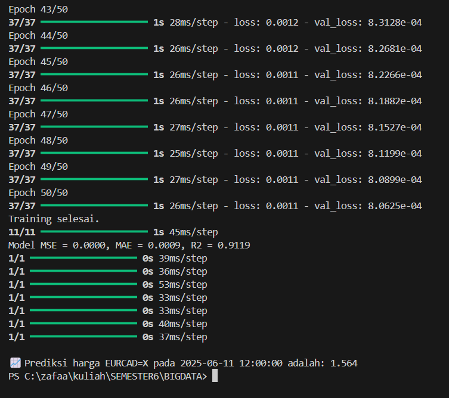
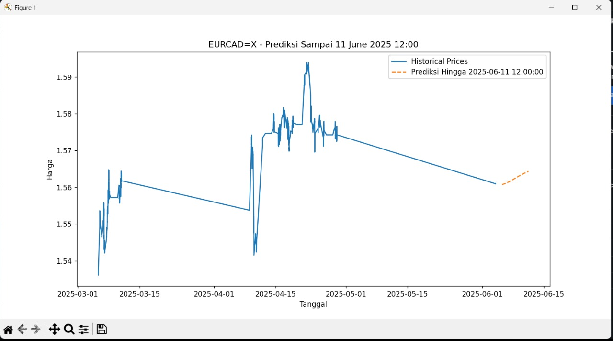

# 📈 Analisis Pasar Forex: Scraping, Visualisasi, dan Prediksi LSTM

    

Proyek Analisis Pasar Forex ini mendemonstrasikan siklus hidup *data science* secara lengkap, mulai dari pengumpulan data dari web, penyimpanan dan visualisasi, hingga pembangunan model *machine learning* untuk prediksi deret waktu (*time-series*).
Studi kasus yang diambil adalah analisis data nilai tukar mata uang asing (*foreign exchange*), sebuah pasar finansial yang dinamis dan kaya akan data.

---

## 🚀 Alur Kerja Proyek

Proyek ini dibagi menjadi tiga tahapan utama yang saling berhubungan:

1.  **Pengumpulan Data (Web Scraping)**: Mengambil data nilai tukar mata uang secara periodik dari sumber publik di internet.
2.  **Visualisasi & Analisis**: Menyimpan data yang terkumpul dan membuat dashboard interaktif untuk menganalisis tren, volatilitas, dan stabilitas pasar.
3.  **Pemodelan Prediktif (Forecasting)**: Membangun, melatih, dan mengevaluasi model *Long Short-Term Memory (LSTM)* untuk memprediksi pergerakan harga di masa depan.

---

### Tahap 1: Pengumpulan Data dengan Web Scraping

Pada tahap ini, data nilai tukar mata uang dari berbagai pasangan (e.g., EUR/USD, USD/JPY) dikumpulkan secara otomatis.

* **Sumber Data**: Yahoo Finance.
* **Metodologi**: Menggunakan library `yahooquery` pada Python untuk berinteraksi dengan API Yahoo Finance, mengambil data harga pasar terkini, perubahan nilai, dan persentase perubahan.
* **Proses**:
    1.  Sebuah skrip Python dijalankan secara periodik (misalnya, setiap 5 menit).
    2.  Setiap data yang diambil diberi penanda waktu (*timestamp*) yang presisi menggunakan library `datetime`.
    3.  Data yang terkumpul disusun dalam format **Pandas DataFrame**.
    4.  DataFrame kemudian disimpan ke dalam sebuah file `currency_rates.csv` dalam mode *append*, sehingga data historis terus terakumulasi dari waktu ke waktu.

---

### Tahap 2: Visualisasi Interaktif dengan Metabase

Data mentah yang telah dikumpulkan kemudian diolah dan divisualisasikan untuk mendapatkan wawasan yang bermakna.

* **Tujuan**: Menganalisis stabilitas, volatilitas, dan tren harga dari setiap pasangan mata uang.
* **Arsitektur**:
    1.  Data dari file `.csv` diimpor ke dalam database **MySQL** yang berjalan di **XAMPP**.
    2.  Aplikasi *Business Intelligence* **Metabase** di-deploy menggunakan **Docker** untuk portabilitas dan kemudahan setup.
    3.  Metabase dihubungkan ke database MySQL untuk membaca data secara langsung.
* **Hasil**: Sebuah dashboard interaktif yang menampilkan berbagai grafik, seperti:
    * Grafik garis pergerakan harga rata-rata dari waktu ke waktu.
    * Grafik batang untuk pasangan mata uang paling volatil dan paling stabil (berdasarkan standar deviasi).
    * Filter dinamis untuk tanggal dan pasangan mata uang tertentu.

---

### Tahap 3: Prediksi Harga dengan LSTM

Tahap akhir adalah membangun model prediktif untuk meramalkan harga mata uang di masa depan.

* **Model**: **Long Short-Term Memory (LSTM)**, sebuah arsitektur *Recurrent Neural Network (RNN)* yang sangat efektif untuk data sekuensial atau *time-series*.
* **Framework**: **TensorFlow** dengan API **Keras**.
* **Proses**:
    1.  **Pra-pemrosesan**: Data historis dimuat, disorting, lalu dinormalisasi ke rentang [0, 1] menggunakan `MinMaxScaler` untuk menstabilkan proses training.
    2.  **Pembuatan Sekuens**: Data diubah menjadi sekuens, di mana 60 data harga sebelumnya (`look_back=60`) digunakan untuk memprediksi 1 data harga berikutnya.
    3.  **Training & Evaluasi**: Model LSTM dengan dua lapisan dilatih menggunakan 80% data. [cite_start]*Early Stopping* digunakan untuk mencegah *overfitting*. Kinerja model dievaluasi menggunakan metrik MSE, MAE, dan R², lalu dibandingkan dengan *naive forecast* sebagai *baseline*.
    4.  **Prediksi Masa Depan**: Sistem memungkinkan pengguna memasukkan pasangan mata uang dan tanggal/jam target, lalu model akan melakukan prediksi secara rekursif hingga mencapai waktu target tersebut.

---

## 🛠️ Tech Stack

| Kategori | Alat & Library |
| :--- | :--- |
| **Pengumpulan Data** | `Python`, `yahooquery`, `pandas`, `datetime` |
| **Penyimpanan Data**| `MySQL`  |
| **Visualisasi** | `Metabase`, `Docker`  |
| **Pemodelan ML** | `TensorFlow (Keras)`, `Scikit-learn`, `NumPy`, `Pandas` |
| **Plotting** | `Matplotlib` |
